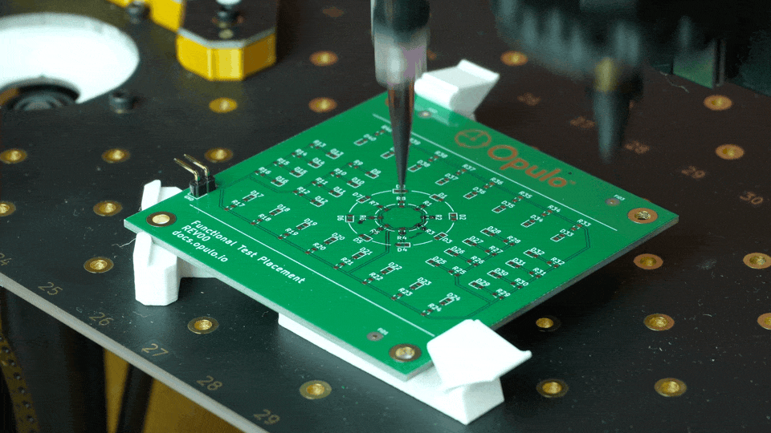

# LumenPnP Paste Extruder

This repository contains the source for a prototype paste extruder head for the LumenPnP.

**This is a prototype design. It is still in development.**

This extruder head is designed for solder paste and conductive ink dispensing applications. It quickly and easily replaces the left toolhead on any version LumenPnP. It has been used to add conductive ink on a PCB, then have the right pick head proceed to populate parts, resulting in a fully working PCBA.

Controlling this toolhead is currently done using `leash`, a python libary for interfacing with the LumenPnP, which can be found [here](https://github.com/opulo-inc/leash).

## Parts

| Item | Quantity |
| ---- | -------- |
| [M3 Nut](https://www.mcmaster.com/90591A250/) | 1 |
| [M3 Threaded Rod](https://www.mcmaster.com/94595A215/) | 1 |
| [Nema 8 Stepper Motor (The higher current rating the better)](https://www.amazon.com/s?k=nema+8+stepper+motor) | 1 |
| [M2x6mm Socket Head Bolt](https://www.mcmaster.com/91290A013/) | 4 |
| [M3 Square Nut](https://www.mcmaster.com/97259A101/) | 1 |
| [M3x18mm Socket Head Bolt](https://www.mcmaster.com/91290A121/) | 1 |
| [3ml Luer Lock Syringe](https://www.mcmaster.com/7510A42/) | 1 |
| [Luer Lock Tip (size depends on application)](https://www.mcmaster.com/products/needles/fitting-connection~luer-lock/dispensing-tips-with-luer-lock-connection/tip-type~tapered/) | 1 |
